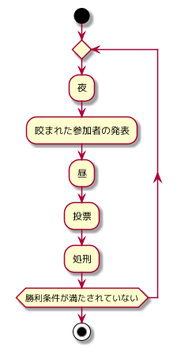
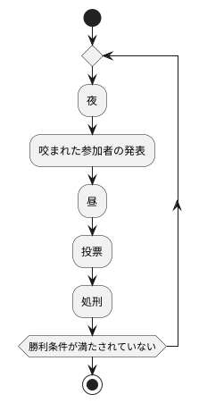

werewolf
-------
# 仕様

## 用語

| 用語               | 英語名             | 説明                                                                |
| ------------------ | ------------------ | ------------------------------------------------------------------- |
| ゲーム             | Game               | ゲーム開始コマンドが投稿されてから勝利条件を満たすまでの間          |
| ゲーム開始コマンド | Game Start Command | ゲームを開始するコマンド。参加者、役職の人数を決定する              |
| ゲーム終了         | Game Over          | 一方の陣営が勝利条件を満たした状態                                  |
| 勝利               | Victory            | 参加者の陣営が勝利条件を満たした状態                                |
| 敗北               | Defeat             | 参加者の陣営以外が勝利条件を満たした状態                            |
| 参加者             | Player             | ゲーム開始コマンドでメンションされた slack ユーザー 役職を持つ      |
| ユーザー           | User               | Slack のユーザー。ゲームに参加することができる                      |
| 役職               | Position           | 参加者の役割をあらわす。役職は陣営に分かれる 一部の役職は能力を持つ |
| 陣営               | Camp               | 役職がどの勝利条件で勝利することができるかを表す                    |
| 生存               | Survival           | 話し合いへの参加、能力の実行ができる状態                            |
| 死亡               | Death              | 話し合いへの参加、能力の実行ができる状態                            |
| 投票               | Vote               | 昼終了後に処刑する参加者を決定する                                  |
| 処刑               | Execute            | 投票によって選ばれた参加者を死亡状態にする                          |
| 昼                 | Daytime            | 処刑する参加者を話し合う                                            |
| 夜                 | Night              | 能力を実行する。人狼同士の会話のみ可能                              |
| 能力               | Ability            | 夜に実行する特別な行動                                              |

## 陣営

| 陣営     | 英語名        | 勝利条件                                   |
| -------- | ------------- | ------------------------------------------ |
| 人狼陣営 | Werewolf Side | 村に生存している参加者の過半数が人狼になる |
| 村人陣営 | Citizen Side  | すべての人狼を死亡状態にする               |

## 役職

| 役職   | 英語名         | 陣営     |
| ------ | -------------- | -------- |
| 人狼   | Werewolf       | 人狼陣営 |
| 狂人   | Psycho         | 人狼陣営 |
| 村人   | Citizen        | 村人陣営 |
| 占い師 | Fortune-teller | 村人陣営 |
| 騎士   | Knight         | 村人陣営 |

## 能力

| 役職   | 能力 | 英語名  | 説明                                                                                           |
| ------ | ---- | ------- | ---------------------------------------------------------------------------------------------- |
| 人狼   | 咬む | Bite    | 人狼以外の参加者を一人指名し死亡状態にする                                                     |
| 占い師 | 占う | Fortune | 自分以外の参加者を一人指名し、人狼かどうかを知る                                               |
| 騎士   | 護衛 | Escort  | 自分以外の参加者を一人指名する。指名された参加者が咬むの対象になった場合でも死亡状態にならない |

## ゲーム進行

## 投票
- 投票は昼のあとに行われる
- 生存している参加者は、自分を含む生存している参加者から一人を選ぶ
- 最多得票(Most votes)を獲得した参加者は処刑される
- 最多得票を獲得した参加者が複数いた場合、決選投票(Final vote)をする
- 決選投票では生存している参加者が、最多得票を獲得した参加者の中から一人を選ぶ
- 決選投票で最多得票を獲得した参加者が複数いた場合、最多得票を獲得した参加者の中からランダムに一人を選び処刑する
